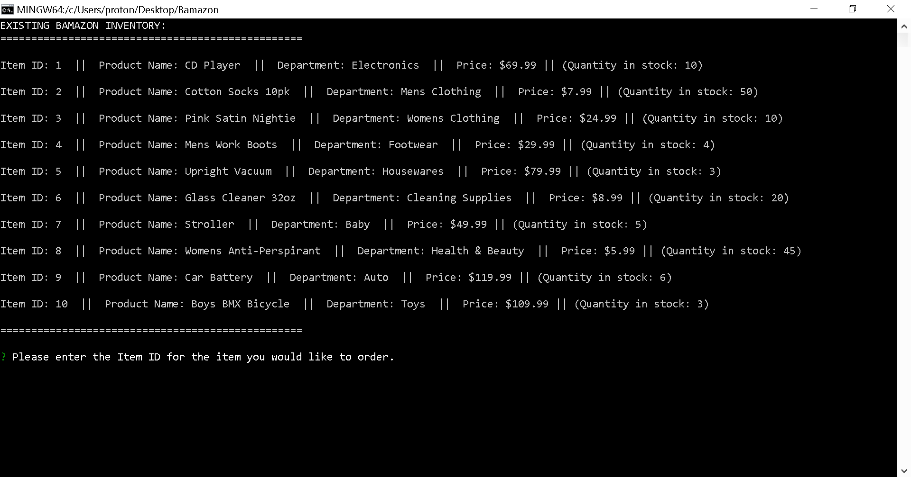
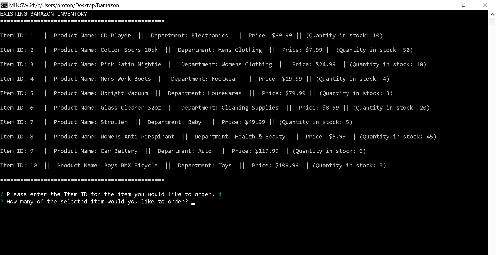
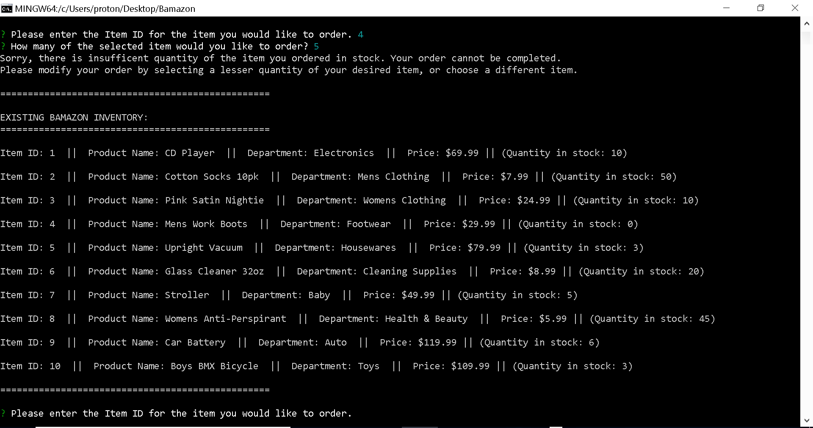
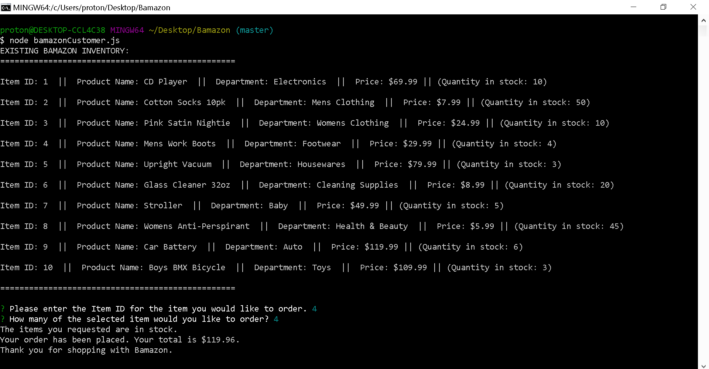

#### BAMAZON CLI NODE APPLICATION

#### __WHAT DOES THIS APP DO?__

Bamazon is an Amazon-like storefront CLI node application which utilizes a MySQL database to keep track of orders and store inventory. This version of Bamazon has the 'Customer View' feature. 'Customer View' provides the customer with a price list of items currently in Bamazon inventory; takes in orders from customers; depletes stock from the store's inventory when an order is placed; and informs the customer of the total cost of the order. The MySQL database is updated when orders are successfully placed;

#### __HOW DO YOU GET STARTED?__

1. Clone or download the repository for Bamazon.

2. Make sure that you have MySQL Workbench installed on your computer.

3. Create a server on your computer using MySQL Workbench and the Bamazon.sql file provided in the Bamazon repository folder which you have downloaded from GitHub:

    - Set up a local connection as follows:
          - Connection Name: Local Connection
          - Connection Method: Standard (TCP/IP)
          - Hostname: localhost
          - Port: 3306
          - Username: root
   - Click 'Store in Vault' and set your password if you don't have one; Leave Default Schema blank

4. Test your MySQL Local Connection; if you cannot establish a connection, see a teacher, TA or tutor for help.

5. Using Visual Studio Code and include your MySQL password on the following lines, of the following files: 

    - bamazonCustomer.js, line 11
    - bamazonManager.js, line
    - bamazonSupervisor.js, line

6. Exit Visual Studio Code.

7. Make sure that you have node.js installed on your computer.

8. Open GitBash or Terminal, making sure that you are in the file location of Bamazon, and run command 'npm install', to complete installation (all necessary apis from npm.js will be downloaded and installed). 

#### __HOW DOES BAMAZON 'CUSTOMER VIEW' WORK?__

#### __WHO MAINTAINS AND CONTRIBUTES TO THIS VERSION OF BAMAZON?__

This version of Bamazon was created by me, Jason Heath Meadows, Esq., currently a student at the University of Arizona Coding Boot Camp, in Gilbert, Arizona. I will maintain and contribute to this app, as necessary, as part of my Portfolio.